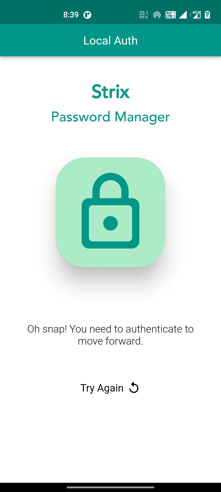
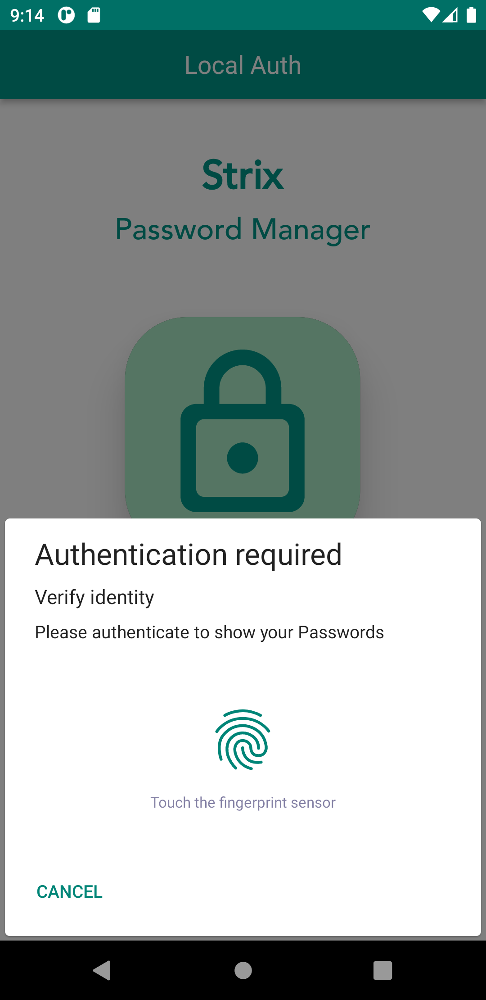
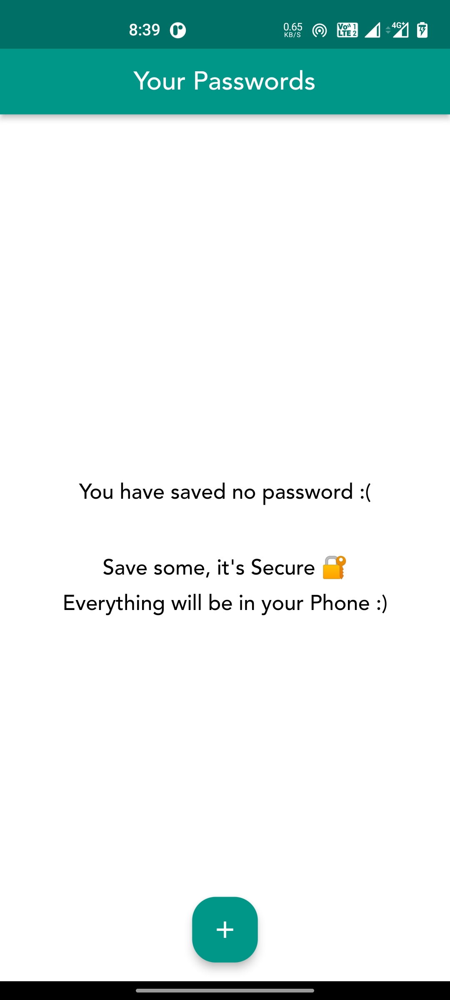
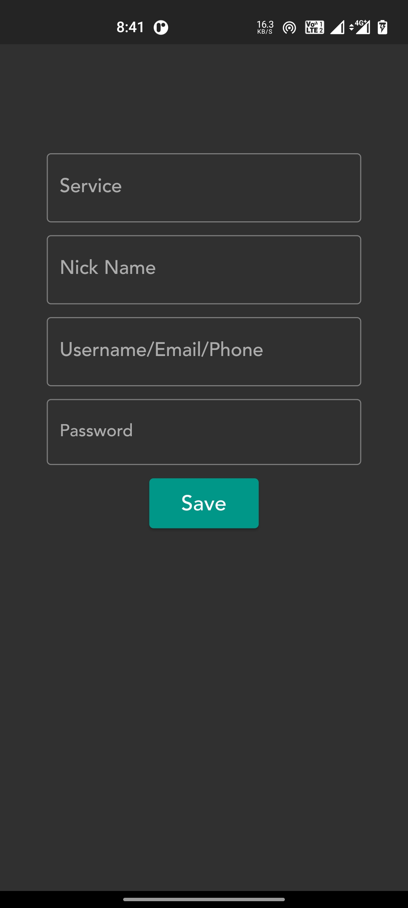
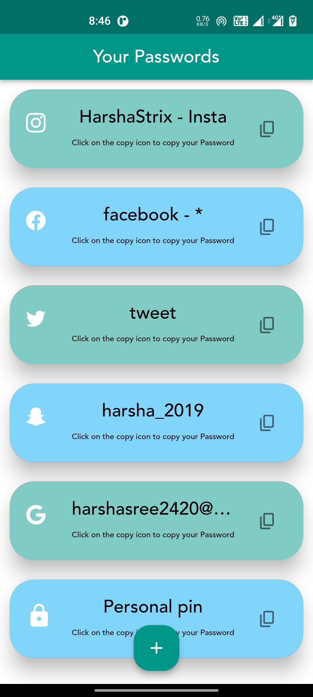
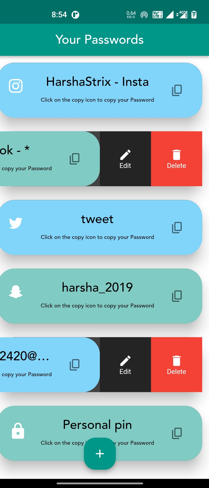
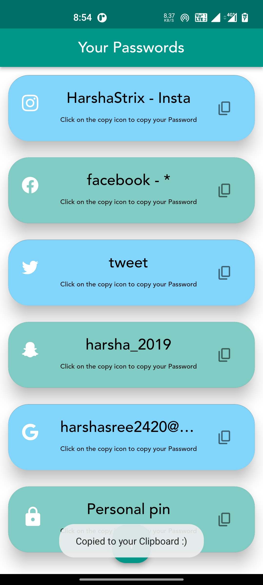

# Flutter - StrixPassword Manager

 A Password manager coded entirely in Flutter that used Three layers of security. It saves password in your Phone's local Storage, thus no issue of data Leak from a server. 

    - Support Local Storage Only as of now
    - Not for web
    - You can easily add Custom Backend
    
# Author
* Sree Harsha - aka [HarshaStrix][website]
* My Portfolio Website - [(myfolio-strixblog)][website]

[website]: https://myfolio-strixblog.web.app/

# Security Layers
    1. Your password String is Encrypted itself.
    2. The Entire Database is encrypted.
    3. Uses Your Phone's Local Bio (Fingerprint) auth.
        - Also it is single-time Allow only, 
          which means if you press home or back, You will have to re-authenticate.

# Security 
    - need to re-authenticate every time app is launched
    - Won't be visible in recent - activity
    - Local Authentication ( Bio )
    - Database is encrypted
    - Passwords are encrypted
    - App Level security

# Data
    - type
    - nick
    - username/email
    - password

# Screenshots

### Local Auth via Fingerprint / PIN

  

### Local Auth via Fingerprint

  

### Your passwords screen

  

### Add button functionality

  

### Your added credentials 

  

### Edit & Delete option

  

### Password will be copied to your Clipboard

  

# Todos
    - add Delete
    - add Edit
    - add a text-auto-fill for correctly mapping icons to service

  
